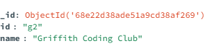
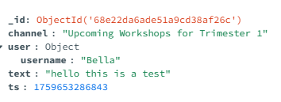

# **3813ICT : Software Frameworks**

**Assignment Phase 2 submission**

**Student Name:** Mariyam Malees Ahmed  
**Student Number:** s5338518

1.Git hub Repository link: [**https://github.com/Malysus28/SF-Assignment.git**](https://github.com/Malysus28/SF-Assignment.git)

## 2.GitHub Repo Info

For phase 2 I used the same repository and maintained the same approach of committing directly to the main branch, because I am the sole contributor for the project it seemed unnecessary at this point to create branches and merge.

I always follow the same method when making Git commits where I write descriptive commit messages that I can easily understand the progress I am making throughout the project. This habit helps me keep track of what changes were made and why. This approach has allowed me to maintain a clear and logical timeline of development. If something breaks or stops working, I can simply refer back to my previous commits to find a stable version.

Overall the commit history has documented my struggles, learning journey and development process.

## 3\. Data Structures

My server.js code contains 4 collections (MongoDB) which are Users, Groups and Messages. These are stored and managed in the MongoDB database. When the server starts, it connects to the database and creates the collections. All data operations like logins, retrieving users and chat history are stored through these collections on the server.js file. I know that this is not the best practice, ideally I want all database operations to be in a separate file to keep code cleaner. However, due to the time constraints and the overall complexity of this project, I decided to focus more on implementing functionality rather than on code organisation for just this section.

- **User collection contains:**
  
- **Group collection contains:**
  
- **Messages collection contains:**
  
- **Channels**
  

## 4.Client and Server Responsibilities

In my project the client (Angular) and the server(node/express) have their own roles.

**Client:** focuses on the UI and what the user sees and interacts with such as messages, active users and available groups. The client side sends login requests to the server and receives responses in JSON format. The client also connects to socket.io to send and receive live messages in real time. It keeps track of logged in user, the current channel, the chat messages, and who is online using simple arrays and objects.

**Server:** The server handles all the data and logic. It connects to the MongoDB database and manages collections (users, groups, messages and channels). When the server starts, it connects to the database and creates the collection if they don't already exist. The server also provides a REST API that returns JSON data when the user logs in, the client sends a request to api/auth and the server checks the MongoDB data for that user and returns their details in JSON format. I have used socket.io to manage real-time chat messages. Socket.io can keep track of which users are online in each channel. At the moment, all server code is in server.js, but ideally I would separate the database and socket code into their own files in the future to make it more organised.

## 5\. Routes, Parameters, Return Values and Purpose

**5.1 POST api/auth**

This is a key route in my project, it is used for user login. When the user logs in, the client sends their **username** and **password** to the server. The server then checks MongoDB to see if the details match an existing user.

The client sends JSON format data with the username and the password. If the login was successful the server send back all the user information (JSON format) with username, birthdate, age, email, role, group, groupNames. If the login fails it should return something like {"ok" : false, "error": "Invalid credentials"}.

This route basically controls the login system, making sure that only valid users can access the app.

**5.2 Socket.io Events**

These are not HTTP routes. They are WebSocket events that client and server use to send/receive data instantly.

| **Event name** | **From -> To** | **What is sent/received**                    | **Functionality**                                                                                                                                                                                                            |
| -------------- | -------------- | -------------------------------------------- | ---------------------------------------------------------------------------------------------------------------------------------------------------------------------------------------------------------------------------- |
| Join           | Client->server | Channel:g1<br><br>User: username             | Joins the selected channel. The server puts the user in the chat room and sends the recent history. It announces the join via system:event (Superadmin:joined the chat), and update the onlineUserer on the right hand side. |
| Chat:history   | Server->client | ChatMessage\[\](olderst to newest, up to 50) | Sends recent messages for the channel right after a successful join, so the user can see the chat history                                                                                                                    |
| Chat:message   | Client->server | { channel, user: { username }, text, ts }    | Sends a new chat message. The server validates it, saves to MongoDB.                                                                                                                                                         |
| system:event   | Server->client |                                              | Notifies the user status for instance user joined chat, user left chat.                                                                                                                                                      |
| onlineUsers    | Server->client | string\[\]                                   | Live list of who's currently online in the active channel. Updates after joins/leaves/disconnect                                                                                                                             |

**5.3 Angular Client Routes (Front end navigation)**

| **Path**                                                                                                                                                                              | **Purpose**                                         |
| ------------------------------------------------------------------------------------------------------------------------------------------------------------------------------------- | --------------------------------------------------- |
| &nbsp; {<br><br>&nbsp; path: 'login',<br><br>&nbsp; component: Login,<br><br>&nbsp; title: 'Login',<br><br>&nbsp; },                                                                  | User login screen                                   |
| { path: '', redirectTo: 'home', pathMatch: 'full' },                                                                                                                                  | Landing page after login                            |
| &nbsp;{ path: 'groups', component: GroupsPage },                                                                                                                                      | Shows groups the user belongs to                    |
| &nbsp; {<br><br>&nbsp; path: 'chat/:name',<br><br>&nbsp; component: Chat,<br><br>&nbsp; title: 'Chat',<br><br>&nbsp; canActivate: \[authGuard\],<br><br>&nbsp; },                     | Open the chat for a specific channel (auth-guarded) |
| &nbsp; { path: 'chat', component: Chat, title: 'Chat' },                                                                                                                              | Chat page without a channel                         |
| { path: 'navbar', component: Navbar, title: 'Navbar' },<br><br>&nbsp; { path: 'create-user',                                                                                          | Standalone navbar component page.                   |
| &nbsp; {<br><br>&nbsp; path: 'user-settings',<br><br>&nbsp; component: UserSettings,<br><br>&nbsp; title: 'User Settings',<br><br>&nbsp; canActivate: \[authGuard\],<br><br>&nbsp; }, | Update user settings.                               |
| &nbsp; {<br><br>&nbsp; path: 'home',<br><br>&nbsp; component: Home,<br><br>&nbsp; title: 'Home',<br><br>&nbsp; },                                                                     | Main landing/ home page.                            |

## 6\. Angular Architecture: Components, Services, Models, Routes

My app is split into components, services, models, and routes. The components are the pages the user sees Login, Home, Groups, Channels, Chat, Profile, Create User, User Settings, plus the shared Navbar. I keep them light, so they focus on the UI and user actions. The heavy lifting happens in services, SocketService handles real-time chat (join, history, messages, system events, online users), and an optional Auth/API service does the login and saves the current user so other parts of the app can use it. Auth Guard protects the pages (Chat, Channels, Profile, User Settings) so only logged-in users can open them.

For data, I used models like UserProfile, Group, and ChatMessage to keep things consistent. Routes map URLs to components, which keeps navigation clear. In short, components make up the UI, services handle the logic and data, models define the shapes, and guards control access, which makes the app straightforward to build and maintain.

**6.1 Components**

- Login: login form which sends username and password to the server.
- Home : landing page after login.
- Groups: shows the groups the user belongs to
- Chat: main chat UI (messages, system events, online users, send box).
- Channels-page : lists available channels for the selected group.
- Navbar: top navigation used across pages.
- Profile: shows the logged-in user's details

**6.2 Services**

**6.2.1 Socket Service:** Handles all real-time chat features using Socket.io.

- - Profile: shows the logged-in user's details
    - Join: joins a channel with a username
    - Chat:message ; sends and receives live messages.
    - System:event; notifies when user joins,leaves when error occur.
    - OnlineUsers ; live list of users currently in the channel.

**6.2.2 Auth Guard:** Stops anyone who isn't logged in from opening protected pages. I used it on Chat, Channels, Profile and User Settings.

**Auth / API Service** Handles login by calling the server's auth endpoint, then saves the returned user info (in local storage). This keeps the login flow simple and lets other parts of the app read the current user without duplicating code.

# ChatClient

This project was generated using [Angular CLI](https://github.com/angular/angular-cli) version 20.1.5.

## Development server

To start a local development server, run:

```bash
ng serve
```

Once the server is running, open your browser and navigate to `http://localhost:4200/`. The application will automatically reload whenever you modify any of the source files.

```

```
